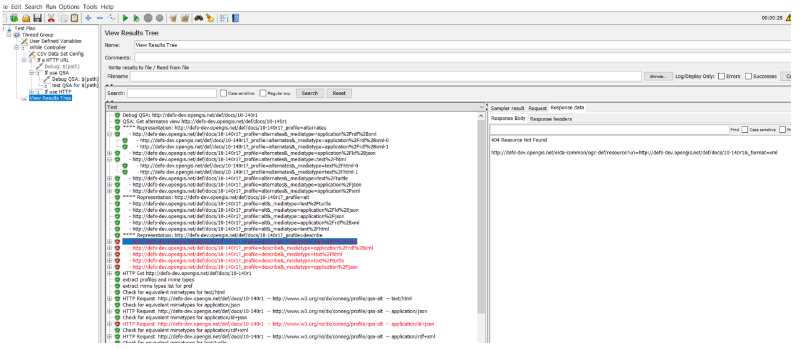

# Content Negotiation by Profile basic tester

An Apache JMeter test for the behaviour of resources implementing "Content negotiation by profile" (CNEG-AP) (https://www.w3.org/TR/dx-prof-conneg/)

The CNEG-AP specification is a standardised mechanism to list available information profiles offered by a server for a given resource, and the media types available per profile. 

This validation suite accesses this list per resource identified and checks each profile returns the correct media type - and identifies the profile being matched.

Both HTTP and QSA (query string argument) methods of CNEG-AP are supported. QSA is only supported for resources offering JSON-LD encodings using the content model defined in the specification. 

## status
This will track the current released version of the specification.

It is fairly crude - contributions to make it easier to configure and improve reporting are welcome.

Tested with Apache Jmeter 5.2.1

## Features
* Checks for both HTTP and Query string argument forms for negotiation
* in QSA mode it reads the canonical *"alt"* profile using JSON-LD to determine all the combinations to test. It checks that the response declares the correct Content-Profile in the HTTP headers.
* in HTTP mode it uses HTTP Link headers accessed via HTTP HEAD requests to determine all combinations
* all combinations of advertised profiles and formats are accessed
* responses are checked for returning the requested profile declaration and response using the correct Mime type only.

## Todo
1. Negotiation can be checked by use of dummy profiles that are not supported in the Accept-profile list, and by inclusion of multiple supported profiles to ensure the preferred option is returned.

## Usage
Open cneg.jmx in Apache Jmeter and update the user variables to point to a file that lists the resources you wish to check (or edit testtargets.csv). Select "view results" and run suite. By default it will show all results. 

Conformance Failures will show in two modes:
1. assertion failures - resources did not behave as expected
2. HTTP request failures - the advertised resource was not honoured by the server

## Issues
JSON-LD may be encoded using prefixes and external context documents. As a canonical context document is not published this mode is not supported - full URIs are necessary.  This matches the behaviour of python RDFLib JSON-LD encoder. If more flexible options are required it is recommended to rebuild this tool in an environment that supports JSON-LD decoding natively.

## possible future improvements (help welcomed)
* resolve profile URIs and get profile descriptions and validation resources - and check not just conneg function but also conformance of resources
* resolve profile URIs and identify profile hierarchies and check that requests for more general profiles return specific profiles.
* check HTTP and QSA are equivalent
* check QSA overrides HTTP
* look in 303-redirected content for profile identification (needs a canonical encoding)
* QSA-ALT testing

## bugs
please lodge an issue in this repo to report bugs.
